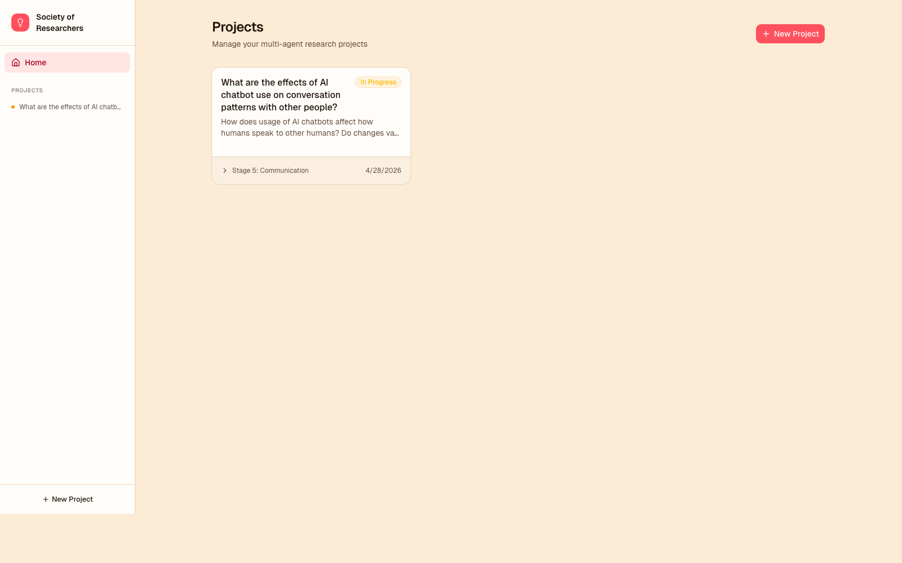
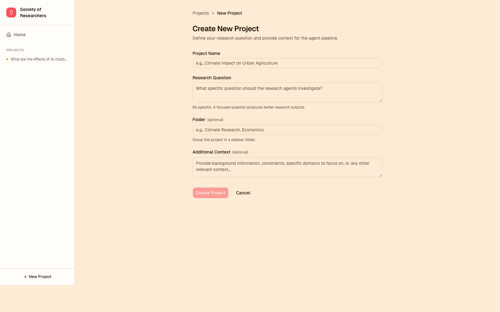
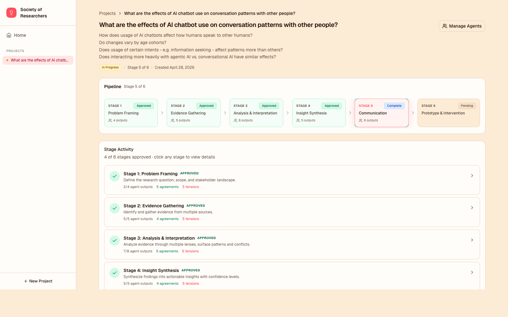
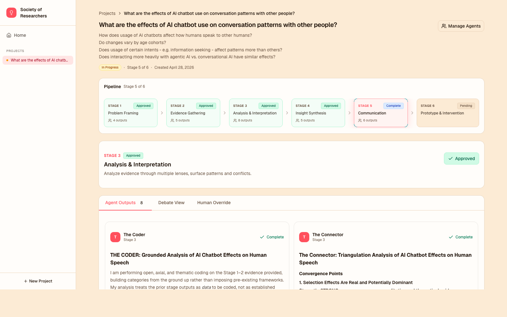
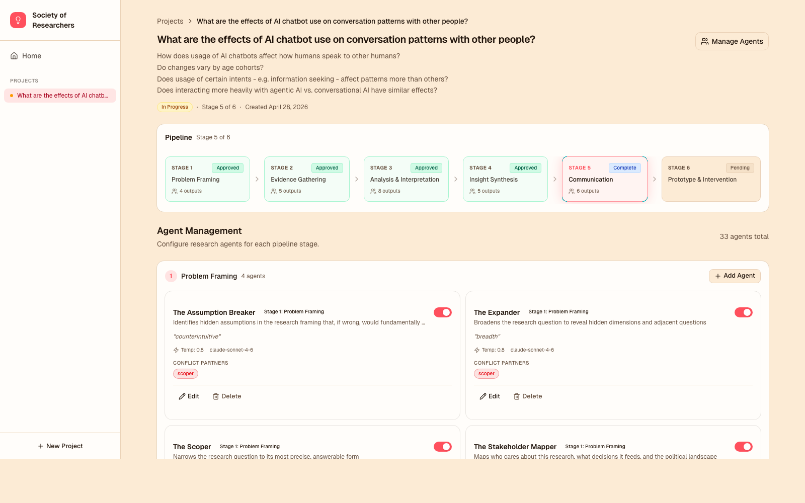

# Society of Researchers

A multi-agent research orchestration system that runs research through 6 stages, each staffed by a panel of AI agents with deliberately conflicting perspectives. A conflict-detection pass surfaces where the agents agree, disagree, and contradict themselves — and a human researcher reviews, edits, and approves at every checkpoint before advancing.

> 🔗 Live demo: **[societyofresearchers.com](https://societyofresearchers.com/)**



## What it is

Most AI research tools collapse multiple model runs into a single answer. This one keeps the disagreement visible. For every stage of a research project, 4–8 agents analyze the same question from incompatible angles, a separate pass extracts their agreements and tensions, and the human picks what to ship. The result is a piece of work where the reasoning is auditable and the human stays in control of the synthesis.

The whole pipeline takes ~2–4 minutes per stage on demo settings (Haiku 4.5, capped output) and ~5–10 minutes per stage on quality settings (Sonnet 4.6, full context).

## Architecture

```
┌──────────────┐    HTTPS     ┌────────────────┐  Anthropic API
│  Vercel      │ ───────────▶ │  Fly.io        │ ───────────────▶  Claude
│  (Next.js)   │   /api/*     │  (FastAPI +    │
│              │  CORS direct │   SQLite vol)  │
└──────────────┘              └────────────────┘
```

- **Backend** — Python 3.13, FastAPI, SQLite on a Fly persistent volume, async Anthropic client. SSE streaming for live agent progress, with a 10-second keepalive ping during long conflict-detection calls.
- **Frontend** — Next.js 16 (App Router), React 19, TypeScript, Tailwind v4, [shadcn/ui](https://ui.shadcn.com/) primitives. Calls the Fly backend directly via `NEXT_PUBLIC_API_URL` (no Vercel proxy — eliminates serverless-timeout failure modes on long stage runs).
- **Deployment** — Vercel auto-deploys frontend on every push to `main`; Fly is deployed via `fly deploy` from `backend/`. Custom domain `societyofresearchers.com` (apex + www) routes to Vercel.

## The 6 Stages

Each stage runs every enabled agent in parallel (subject to a configurable Anthropic concurrency cap), then runs a separate "conflict detector" call against the combined outputs to extract agreements, disagreements, internal contradictions, and a synthesis paragraph.

| Stage | Name | Default agents |
|------:|------|----------------|
| 1 | Problem Framing | The Scoper, The Expander, The Stakeholder Mapper, The Assumption Breaker |
| 2 | Evidence Gathering | The Archivist, The Fieldworker, The Quantifier, The Skeptic, The Outlier Hunter |
| 3 | Analysis & Interpretation | The Coder, The Theorist, The Contrarian, The Connector, The Narrator, The Pattern Breaker, The Verifier, The Contradiction Hunter |
| 4 | Insight Synthesis | The Strategist, The Confidence Rater, The Reframer, The Specificity Enforcer, The Surprise Synthesizer |
| 5 | Communication | The Executive Briefer, The Detail Builder, The Visualizer, The Provocateur, The Decision Framer, The Revelation Writer |
| 6 | Prototype & Intervention | The Solution Sketcher, The Feasibility Checker, The Experience Critic, The Experiment Designer, The Anti-Solution Auditor |

33 default agents in total. Each has a distinct system prompt, a perspective, and an explicit list of "conflict partners" — other agents whose output it should be compared against in the debate view.

## How it works

### 1. Create a project

You start with a research question. Optional: add background context, file uploads, and a folder to group related projects.



### 2. Run a stage and watch agents complete in parallel

Each stage card shows status, description, and live progress. The pipeline strip up top shows where you are across the 6 stages — current stage in coral, approved stages in green.



When you click **Run Stage**, agents start in waves (capped at 2 concurrent on the demo tier to stay under Anthropic's connection limit) and stream their outputs back as they complete.



### 3. Review the debate

After all agents finish, the **conflict detector** pass extracts where they agree, where they disagree (with each agent's position and confidence), what tensions remain unresolved, and a synthesis paragraph. Agreements are styled green, disagreements destructive-red, and unresolved tensions amber.

The debate view is where the value is — most "give me an answer" AI tools paper over the disagreements; this one foregrounds them.

### 4. Edit, override, or accept

The **Human Override** tab on each stage lets you write your own synthesis or correct the agents' output entirely. Notes you leave are surfaced on subsequent stages. Approved overrides become the canonical text that downstream stages see.

### 5. Approve and advance

Approving a stage locks its output and passes it as context to the next stage's agents. After all 6 stages are approved, the system generates a comprehensive markdown research report from the cumulative findings.

### Agent management

Toggle agents on/off per project, edit their system prompts, change temperature and stage assignment, or create entirely new ones. Conflict-partner relationships are first-class and feed into the debate analysis.



## Quick start (local dev)

```bash
# 1. Backend
cd backend
cp .env.example .env
# edit .env and add your ANTHROPIC_API_KEY
uv sync
uv run uvicorn sor.main:app --reload --port 8000 --app-dir src

# 2. Frontend (in another terminal)
cd frontend
npm install
npm run dev
```

Open http://localhost:3000

The Next.js dev server proxies `/api/*` to `http://localhost:8000` automatically when `NEXT_PUBLIC_API_URL` is unset, so no extra config is needed for local dev.

## Configuration

Backend reads these from `backend/.env` (or env vars on the deployed host):

| Variable | Default | What it does |
|----------|---------|--------------|
| `ANTHROPIC_API_KEY` | _(required)_ | Anthropic API key |
| `DEFAULT_MODEL` | `claude-sonnet-4-6` | Model for conflict detection + report generation (full quality) |
| `AGENT_MODEL` | _(unset)_ | If set, overrides the per-agent stored model. Use `claude-haiku-4-5-20251001` for fast demos |
| `AGENT_MAX_TOKENS` | `4096` | Cap on response length per agent run |
| `AGENT_MAX_CONCURRENCY` | `3` | How many agent calls hit Anthropic at once. Lower this if you hit `429: concurrent connections` errors |
| `DATABASE_PATH` | `./data/sor.db` | SQLite path |

Demo-mode preset (set on the live Fly app):

```bash
AGENT_MODEL=claude-haiku-4-5-20251001
AGENT_MAX_TOKENS=1200
AGENT_MAX_CONCURRENCY=2
```

To dial back up to quality mode: `flyctl secrets unset AGENT_MODEL AGENT_MAX_TOKENS AGENT_MAX_CONCURRENCY --app sor-backend`.

## Deployment

### Backend → Fly.io

```bash
cd backend
flyctl launch  # first time only — uses the bundled fly.toml
flyctl deploy --remote-only
```

Notes:
- `min_machines_running = 1` in `fly.toml` keeps the box warm — important because Fly's autostop will kill in-flight SSE streams.
- `ANTHROPIC_API_KEY` must be set as a Fly secret: `flyctl secrets set ANTHROPIC_API_KEY=sk-ant-...`
- A 1 GB volume is mounted at `/data` for the SQLite DB.

### Frontend → Vercel

GitHub auto-deploy is wired — pushing to `main` triggers a production build. The project is configured with `rootDirectory: frontend` in Vercel.

`NEXT_PUBLIC_API_URL` must be set in Vercel env vars (Production + Preview + Development) to your Fly backend URL — e.g. `https://sor-backend.fly.dev`. This makes the browser call the backend directly via CORS, avoiding Vercel's serverless function timeout for long-running SSE streams.

## Reliability notes

A few things that took fighting with to get the pipeline reliable:

- **SSE keepalive** — `EventSourceResponse(ping=10)` so intermediate proxies don't kill the stream during the silent 70–120s conflict-detection LLM call.
- **Anthropic concurrency cap** — Anthropic enforces a per-tier "concurrent connections" limit separate from RPM/TPM. With 8 agents running `asyncio.gather`, that cap trips immediately on lower tiers. The orchestrator now uses an `asyncio.Semaphore` with `AGENT_MAX_CONCURRENCY=2` for the demo tier.
- **Jittered retries with `Retry-After`** — the LLM client honors Anthropic's `retry-after` header on 429s and falls back to jittered exponential backoff. Without jitter, all retrying agents collide on the same wakeup tick and re-trip the limit.
- **Frontend auto-recovery** — if the SSE stream drops without a `stage_complete` event, the client polls the persisted stage state for up to 90 seconds. If the backend has actually finished, it replays the missing events and the UI advances normally instead of showing a "connection closed" error.
- **Direct frontend → backend** — `NEXT_PUBLIC_API_URL` points the browser straight at Fly. Going through a Vercel rewrite would have exposed the SSE stream to Vercel's serverless function timeout (30s), which kills any non-trivial stage run.

## Project structure

```
society-of-researchers/
├── backend/
│   ├── src/sor/
│   │   ├── config.py            # Settings (env-driven)
│   │   ├── main.py              # FastAPI app + lifespan
│   │   ├── engine/
│   │   │   ├── orchestrator.py  # Stage runner, semaphore, SSE events
│   │   │   ├── llm_client.py    # Async Anthropic client w/ retries + jitter
│   │   │   ├── conflict_detector.py
│   │   │   └── defaults.py      # 33 default agent definitions
│   │   ├── routes/              # /projects, /stages, /agents, /documents
│   │   └── store/               # SQLite via aiosqlite
│   ├── fly.toml
│   └── pyproject.toml
└── frontend/
    └── src/
        ├── app/                 # Next.js App Router pages
        ├── components/ui/       # shadcn/ui primitives + custom layout
        ├── components/agents/   # Agent management UI
        ├── components/stage/    # Stage view (output cards, debate view)
        ├── components/pipeline/ # Pipeline canvas
        └── lib/
            ├── api.ts           # Typed API client
            ├── sse.ts           # SSE handler with auto-recovery
            └── types.ts         # Project/AgentConfig/StageResult types
```
